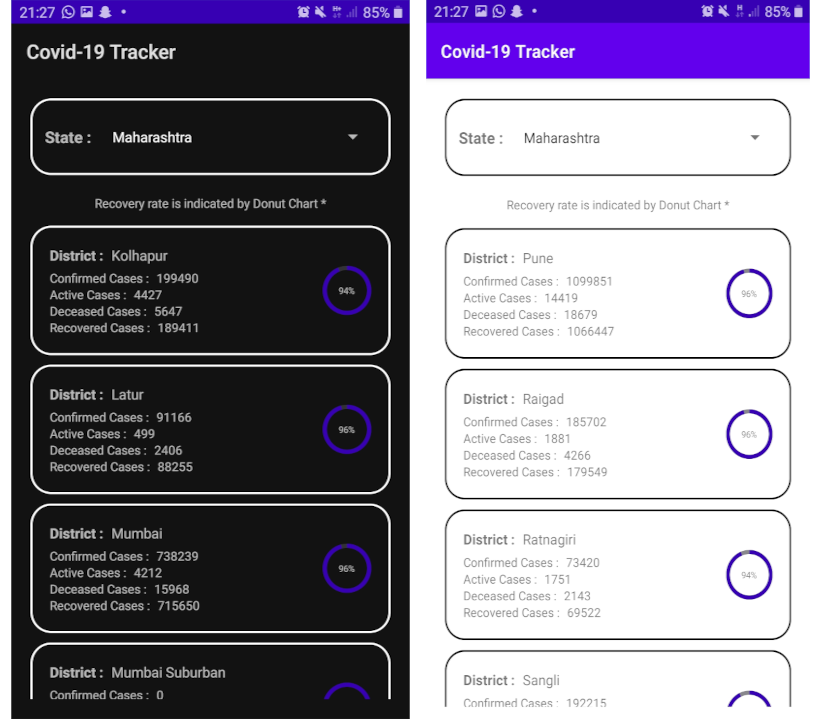

###  
 Covid-19 Tracker

#### Fetures

- Original / True data from government API.
- Statewise Displayed
- Recovery Rate displayed by Donut chart.
- Dark/Light Mode
- Cleaner interface

 

#### Prerequisites :
- Android Studio
- Basic knowledge about android development (Optional)

#### How to Build this Project?
- Clone this project or Download Zip.
- Extract it and Open the Project in Android Studio.
- Wait to download required files.
- Check if [this](https://data.covid19india.org/state_district_wise.json) government API provides data or not.
- Build App
- Install it on Emulator or Real Device.

 
Full Project demonstration Youtube : 
Link - https://youtu.be/GmwOPyji0bs
